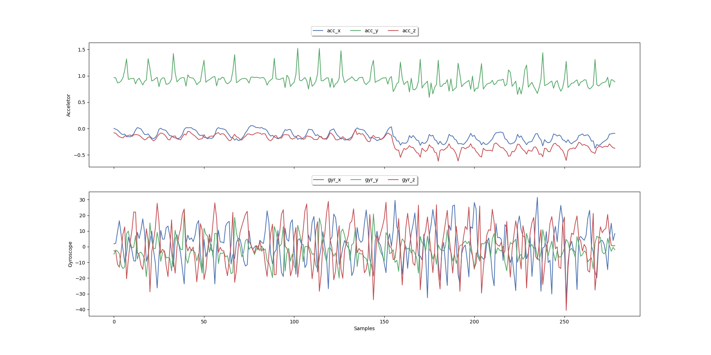
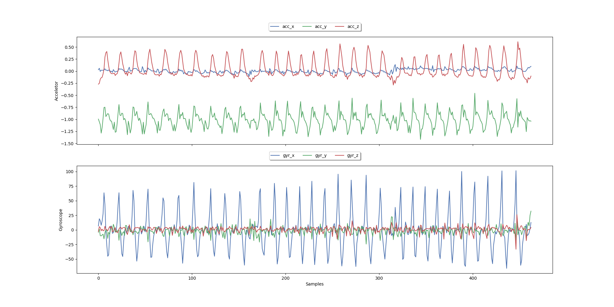
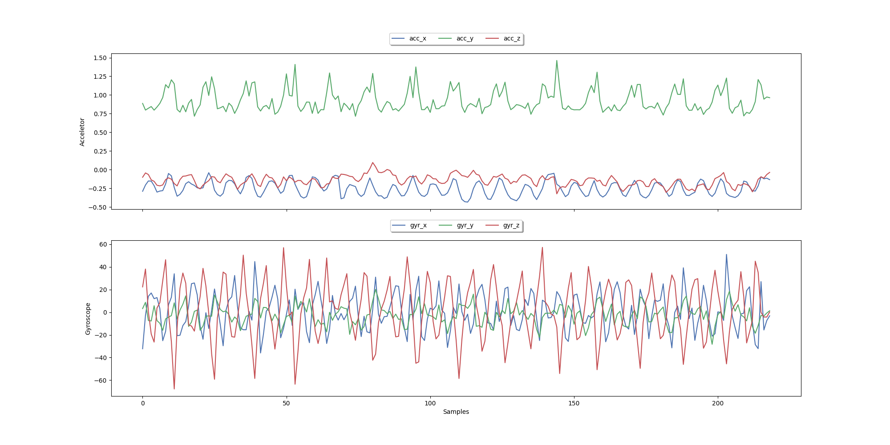
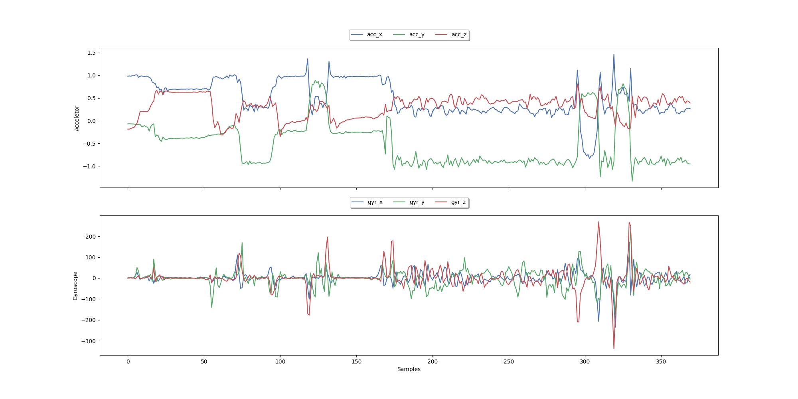
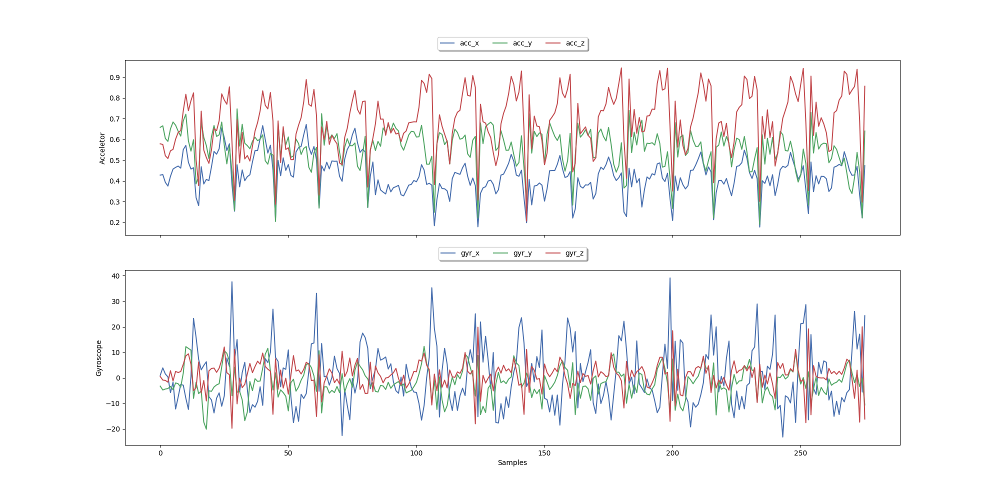

# 🏋️ Fitness ML - Exercise Classification System

    
    
    
    
    

A sophisticated machine learning system for classifying fitness exercises using sensor data from wearable devices.

## 📊 Overview
This project applies machine learning techniques to recognize and classify different strength training exercises (bench press, squat, deadlift, overhead press, row) using accelerometer and gyroscope data from wearable sensors. The system processes raw sensor data, extracts meaningful features, and employs various classification algorithms to identify exercise types with high accuracy.

## 🚀 Key Features
- **Data Processing Pipeline**: Transforms raw sensor data into structured datasets
- **Advanced Feature Engineering**:
  - Temporal abstractions (mean, standard deviation)
  - Frequency domain features (FFT transformation)
  - Principal Component Analysis (PCA)
  - Statistical features and clustering
- **Multiple Classification Models**:
  - Random Forest
  - Neural Networks
  - K-Nearest Neighbors
  - Decision Trees
  - Naive Bayes
- **Model Evaluation Framework**: Comprehensive comparison of model performances
- **Repetition Counting**: Algorithm for counting exercise repetitions
- **Visualizations**: Detailed plots of sensor data, feature importance, and model results
- **Outlier Detection**: Automatic identification and removal of anomalous data points
## 📸 Sample Visualizations

    
    
    
    
    

## ⚙️ Setup and Installation
### Prerequisites
- Python 3.8+
- Conda (recommended for environment management)

### Installation Methods
1. **Using Conda**
2. **Using pip**

## 📈 Usage Examples
- Data Processing
- Model Training and Evaluation
- Visualization

## 🧪 Technical Approach
### 1. Data Collection
- Wearable sensors (accelerometer and gyroscope)
- Multiple participants performing 5 different exercises
- Various intensity levels (medium and heavy)

### 2. Preprocessing
- Timestamp alignment
- Resampling (harmonizing different sensor frequencies)
- Missing value imputation
- Outlier removal using Chauvenet's criterion

### 3. Feature Engineering
- Low-pass filtering: Noise reduction with Butterworth filter
- Statistical features: Mean, standard deviation, min/max
- Temporal abstractions: Rolling window statistics
- Frequency domain features: Fast Fourier Transform
- PCA: Dimension reduction while preserving variance

### 4. Model Selection
- Grid search for hyperparameter optimization
- Cross-validation to ensure generalization
- Performance metrics: accuracy, confusion matrix

## 🔬 Results
The system achieves over 90% accuracy in classifying exercises across different users and intensity levels.

**Key findings:**
- Frequency-domain features provide significant discriminative power
- Gyroscope data complements accelerometer data for better classification
- PCA helps reduce dimensionality while maintaining performance

## 💡 Future Enhancements
- Real-time exercise classification
- User-specific model calibration
- Integration with mobile applications
- Transfer learning for new exercise types
- Detailed form/technique feedback

## 📞 Contact
- Email: dataversaiesolutions@gmail.com
- LinkedIn: @sahilthorat

## 📄 License
This project is licensed under the MIT License - see the LICENSE file for details.

    
Made with ❤️ and Python

    
⭐ Star this repository if you found it useful! ⭐

